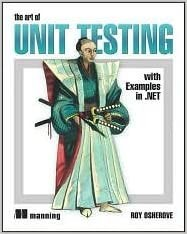

# UnitTesting
# TDD

::image::


<!-- Quote from "Working Effectively with Legacy Code": In a poorly designed system, making a change feels like jumping off a cliff to avoid a tiger. -->

---
layout: agenda
size: sm
items:
  - Role Team Leads & Architects
  - Why?
  - What? 100% Coverage?
  - Feedback Loop & Mocking
  - Implementation Considerations
  - Common Pitfalls
  - TDD
---

<!-- What – A Definition: Unit testing is the process of writing code to test the behavior and functionality of your system. -->

---
layout: quote-image
---

# Inspirational Quote

::image::


---
layout: quote-image
hide: true
---

# Inspirational Quote

::author::

::image::


<!-- For example: Eiffel, Rust, Elixir -->

---
layout: section
---

# UnitTesting?

::subtitle::

Job of the Tech Lead / Architect


---
layout: two-col-image-text
image: ./images/meme-2-unit-tests-no-integration.jpg
---

# UnitTesting?

## It does not cover all bases

<!-- Note that we are only talking about UnitTesting here. Other tests, like integration tests are also needed! -->


---
layout: default
---

# The Testing Pyramid

<TestingPyramid />

<!--
The Testing Pyramid (Mike Cohn): Most tests should be unit tests (fast, cheap, isolated). Fewer integration tests (test how components work together). Fewest E2E/UI tests (slow, brittle, expensive to maintain).
Anti-pattern: The Ice Cream Cone - too many manual/E2E tests, not enough unit tests.
-->


---
layout: default-aside
h1:
  type: hash
  color: primary
  position: start
---

# UnitTesting?

## Job of the Tech Lead / Architect

<v-clicks>

- Setup Testing
- Configure CI
- Convince Managers, Business, ...
- Teach/Help with implementation

</v-clicks>

::image::


<!--
Setup Testing: Setup the project, add the dependencies (xUnit, Mockito, ...), and have at least one working UnitTest even if it's a dummy one. If the framework for UnitTesting is already there, it's so much easier for the developers to actually write some tests.
Configure CI: If the tests do not run on the CI and block the CI in case of issues - it's basically the same as not having a UnitTest suite at all.
Teach/Help: Many developers still don't have (a lot) of experience with UnitTesting. They may need help writing a test for a tricky part of code.
-->

---
layout: section
---

# Why

---
layout: default-aside
h1:
  type: semicolon
  color: muted
  position: start
---

# Why

<v-clicks>

- Small continuous steps forward
- Avoiding Regressions
- Living Documentation
- Quick Feedback Loop (Avoid I/O)
- Fixing Bugs
- Thinking about Design
- Pay Now vs Pay More Later

</v-clicks>

::image::


<!--
Small continuous steps forward: When the going gets so tough that you are not making progress at all. One of the advantages of working in a TDD style.
Avoiding Regressions: After every change to the code, the test suite is run. You can also refactor without fear. (Working Effectively with Legacy Code)
Living Documentation: Weird rules are defined in the code. Also a way for new developers to get acquainted with the API surface. This is also a case AGAINST parameterized tests - they typically leave you hanging when they fail.
Quick Feedback Loop: If it takes 30min to run the test suite, developers will not bother running it locally. Avoid I/O: network, FileSystem, DB, ...
Fixing Bugs: Found a bug? Write tests for it and the test suite will catch regressions.
Thinking About Design: Adding UnitTests forces the developer to think about Design.
Pay More Later: Writing tests takes time. How much time is wasted? YES - Google was held captive by fear of change, until they made UnitTesting mandatory. The team needs to get over "the hump".
-->

---
layout: default
---

# What? "FIRST"

<v-clicks>

- **Fast** -- Feedback loop
- **Independent** -- Tests should not interact with one another
- **Repeatable** -- Without code change test results do not change
- **Self-Validating** -- No manual steps allowed!
- **Thorough** -- Don't just test the happy path
  - Or: **Timely** -- write them at the same time

</v-clicks>

<!--
Fast: 1/10th of a second
Independent or Isolated: Test sequence should not be important. Avoid tests that need to run after a certain test in order to setup the inputs correctly.
Repeatable: Do not depend on things that can change: the records in a database, relying on the current time, a certain file being on the FileSystem, ...
Self-Validating: Tests should succeed or fail without human interaction. Do not check console.logs manually.
Timely: Writing the tests later is more expensive because we're already less familiar with the problem and the code
-->

---
layout: default
h1:
  type: brackets
  color: muted
  position: all
---

# What

<v-clicks>

- Business Logic / Weird Rules
- Legacy Code
- Regression Galore
- Technical Frameworks / Design
- "select isn't broken"

</v-clicks>

<!--
Business Logic: UnitTests can be your documentation for that Illogical Business Logic.
Legacy Code: Fixing one thing breaks another thing? All the time? UnitTests can be your friend.
Technical Frameworks: If you are introducing design to eliminate duplication. These "small frameworks" should be tested thoroughly.
"select isn't broken": Pragmatic Programmers tip: It is rare to find a bug in the OS, Compiler, Language framework libraries. Do NOT write tests for these things.
-->

---
layout: section
---

# 100% Coverage?

---
layout: two-col-image-text
size: md
---

# 100% Coverage?

::image::


::content::

<v-clicks>

- Startup Code?
- Trivial Code?
- Branchless Code?
- Technical Code?
- One-time migrations?
- Configuration as Code?

</v-clicks>

<!--
Personal Choice - however is there much value in testing the following:
Startup Code: Do you want to test setting up your IOC container?
Trivial Code: Do you want to test constructors? Getters/Setters?
Branchless Code: If there are no if/switch branches - do you still want to test it?
Technical Code: Do you want to test your implementation of ILogger? EntityFramework EntityConfiguration?
One-time migrations: Do you want tests for a migration that will run only once?
-->


---
layout: default-aside
---

# Mutation Testing
## Test what your code coverage % is worth

<v-clicks>

- **Mutate** — Automatically inject bugs into your code
- **Test** — Run your test suite against mutants
- **Survive?** — If tests pass, they're weak
- **Killed?** — Your tests caught the bug

</v-clicks>

<div v-click class="mt-8">

Tools: **Stryker** (JS/TS), **PITest** (Java), **Stryker.NET** (C#)

</div>

::image::


<!--
Mutation testing validates test quality, not just coverage. A mutant "survives" if your tests don't catch the injected bug.
Common mutations: change > to >=, replace + with -, remove method calls, change true to false.
High mutation score = tests actually verify behavior. 100% coverage with 50% mutation score = weak tests.
-->

---
layout: default-aside
---

# But What?

<v-clicks>

- A Happy Path / Sunny Day Test
- Test Branches (if/switch)
- Unhappy paths (GuardClauses, Exceptions, ...)
- Common / Real World Scenarios
- Boundaries

</v-clicks>

::image::


<!--
Happy Path: Have at least one test to cover the happy path where everything works entirely as expected.
Branches: If you have an "if": make sure there is a test covering all if/else statements.
Unhappy Paths: Also test that the software behaves as expected when things do go wrong. Validation failure, unexpected exceptions, short circuiting guard clauses, ...
Scenarios: If you know the test data / scenarios the Tester/FA is going to use, you can write those tests.
Boundaries: Boundary Value Analysis and Equivalence Partitioning.
-->

---
layout: default-aside
h2:
  type: brackets
  color: muted
  position: all
---

# But What?

## Code Coverage vs Branch Coverage

```cs
// Example 1
if (condition1) {} else {}
if (condition2) {} else {}
```

```cs
// Example 2
if (cond1 && (cond2 || cond3)) {}
```

<!--
Code Coverage aka Statement Coverage vs Branch Coverage aka Decision Coverage
Example 1: For 100% Code Coverage, 2 tests are needed. For 100% Branch Coverage, 4 tests are needed.
Example 2: Code Coverage: 1 test. Branch Coverage: 4 tests.
-->

::image::


---
layout: default-aside
h1:
  type: braces
  color: primary
  position: all
---

# But What?

## Boundaries

<v-clicks>

- Equivalence Partitioning
- Boundary Value Analysis
- Edge Case Testing

</v-clicks>

::image::


<!--
Equivalence Partitioning: Example: we expect a Percentage between 0 and 100. An invalid low value (ex: -10), a correct value (ex: 20), an invalid high value (ex: 200).
Boundary Value Analysis: Instead of using semi-random values, we use values at the boundaries. The values -1 and 0, the values 100 and 101.
Edge Case Testing: Add tests for NULL, PositiveInfinity, NaN, ...
-->

---
layout: code-comparison
before-label: Equivalence Partitioning
after-label: Edge Cases
code-size: 0.85em
---

# Boundaries

## isValidPercentage(n)

::before::

```ts {1-2|4-6|0}
// All negative values belong to the same partition
test("rejects negative", () => expect(valid(-20)).toBe(false))

// The percentage validation function has 2 more partitions
test("accepts valid", () => expect(valid(20)).toBe(true))
test("rejects over 100", () => expect(valid(200)).toBe(false))
```


### Boundary Value Analysis


```ts {0|1-2|3-4|0}
test("low boundary",  () => expect(valid(-1)).toBe(false))
test("low boundary",   () => expect(valid(0)).toBe(true))
test("high boundary", () => expect(valid(100)).toBe(true))
test("high boundary", () => expect(valid(101)).toBe(false))
```

::after::

```ts {0|all}
test("null",      () => expect(valid(null)).toBe(false))
test("NaN",       () => expect(valid(NaN)).toBe(false))
test("Infinity",  () => expect(valid(Infinity)).toBe(false))
test("string",    () => expect(valid("50")).toBe(false))
```

---
layout: section
---

# Quick Feedback Loop

::subtitle::

Achievable Only By Avoiding I/O

---
layout: default-aside
image-position: middle-right
h1:
  type: semicolon
  color: muted
  position: end
h2:
  type: braces
  color: muted
  position: 4-5
---

# Quick Feedback Loop

## Achievable Only By Avoiding I/O

<v-clicks>

- Database
- FileSystem
- Network Access
- Rest Calls

</v-clicks>

::image::


<!--
Database: If you use a Db in a "UnitTest", you need to setup this Db before the test so that it is in a predictable state. If multiple tests are using the same db, they could interfere with each other.
Network Access: Some other service, endpoint, dns, ...
Rest Calls: Talk to some third party service to send email(s)
=> MOCKING
-->

---
layout: default
---

# Quick Feedback Loop

## Achievable Only By Avoiding I/O

| Operation | Typical Latency | Overhead Compared to RAM |
|---|---|---|
| In-Memory Access | 10-100 ns | Baseline |
| SSD Read | 50-100 us | ~500x to 1,000x |
| HDD Read | 5-10 ms | ~10,000x to 100,000x |
| Network File Access | 1-10 ms | ~10,000x or more |

---
layout: two-col-image-text
---

# Test Doubles

::image::


---
layout: default-aside
size: lg
h1:
  type: semicolon
  color: muted
  position: start
---

# Test Doubles

<v-clicks>

- **Dummy**: Passed around but not relevant for the test itself
- **Fake**: Has actual implementation but takes shortcuts
- **Stub**: Provide canned values
- **Spy**: Record what happened, what methods were (not) called
- **Mock**: Stub + Spy

</v-clicks>

::image::


<!--
Which one to use? WHO CARES? Use whatever makes most sense: do not use a mock for a DTO, just instantiate it.
Dummy: Could be "null" or a NullObject or a default value.
Fake: Example InMemoryDb.
Spy: How many times was the EmailService invoked?
Mock: Typically with a mocking framework (Mockito/Moq).
Sometimes also handy OUTSIDE of testing: the real implementation is not available yet, or the real implementation costs the company money.
-->

---
layout: statement
---

Abstract the I/O dependencies away.

Program against an interface, not an implementation.

<!--
Inject interfaces for things that need to be mocked. Dependency Injection is your friend here.
Also: DateTimeProvider - writing UnitTests for code that does a GetCurrentDate() is hard, so we provide an interface so we can return a canned date value.
Strict Mock vs Non-Strict Mock: Strict will fail for anything that was not explicitly setup.
Messy Setup Code: If you're having a lot of mock setup, does everything need to be a mock, really?
-->

---
layout: comparison
---

# Mocking

## Mockist vs Classicist

<div class="cols">
<div class="col">

### Mockist / Solitary

🧐 Mock everything
<br>✅ Test complicated BL in isolation
<br>⚠️ Danger of creating <b>tautological tests</b>, testing implementation instead of behavior

</div>
<div class="col">

### Classicist / Sociable

🧐 Mock I/O and/or "awkward" things
<br>✅ Tests survive refactorings more easily
<br>⚠️ Danger of testing the same thing multiple times

</div>
</div>

<!--
Mockist: Watch out for "Tautological Tests". You want to test BEHAVIOR, not IMPLEMENTATION.
Classicist: https://www.thoughtworks.com/insights/blog/mockists-are-dead-long-live-classicists
Also see: https://martinfowler.com/articles/mocksArentStubs.html
Solitary vs Sociable: https://martinfowler.com/bliki/UnitTest.html
-->

---
layout: code
code-size: 1.1em
---

# Mockist Testing

## When there is no BL

```cs {1-2|4-5|7-8|all}
var repo = Substitute.For<IRepository>();
repo.Get().Returns(["obj1", "obj2"]);

var ctl = new Controller(repo);
var result = ctl.Get();

Assert.That(result[0], Is.EqualTo("obj1"));
Assert.That(result[1], Is.EqualTo("obj2"));
```

<div class="full-width text-3xl text-center mt-8 italic text-orange-400">
⚠️ What are you truly testing here?
</div>


---
layout: two-col-image-text
h1:
  type: semicolon
  color: muted
  position: end
---

# Tautological Tests

::image::


<!--
Tautological Tests: You want to test BEHAVIOR, not IMPLEMENTATION.
https://fabiopereira.me/blog/2010/05/27/ttdd-tautological-test-driven-development-anti-pattern/
https://chrisoldwood.blogspot.com/2016/11/tautologies-in-tests.html
-->

---
layout: code
code-size: 1.2em
h1:
  type: semicolon
  color: muted
  position: end
---

# Tautological Test

## It just repeats the code

```cs {1|3-4|6|all}
var service = Substitute.For<IService>();

var ctl = new Controller(service);
var result = ctl.Get();

service.Received().Get();
```


<div class="full-width text-3xl text-center mt-8 italic text-orange-400">
⚠️ Zero behavior verification <br>
⚠️ Breaks on any change and/or refactoring
</div>


---
layout: default-aside
size: lg
h1:
  type: brackets
  color: muted
  position: all
---

# State vs Behavior

<v-clicks depth="2">

- **State Testing**
  - Assertion Territory
  - Validate that a property has a certain value
  - ✅ Most tests should do state testing
- **Behavior Testing**
  - Mocking Territory
  - Validate that a method was (not) called

</v-clicks>

::image::


<!--
State: When updating an entity, the audit fields LastModifiedBy and LastModifiedOn are properly updated. When doing a calculation, assert that the result returned is as expected.
Behavior: Verify that a method was (not) called, or called with specific arguments. Example: verify that an email is (not) sent, or that Repository.Save() is called.
-->

---
layout: code-comparison
before-label: State Testing
after-label: Behavior Testing
code-size: 0.93em
---

# State vs Behavior

::before::

```ts {2-5|7|all}
test("setsStatusToCompleted", () => {
  const emailService = mock<EmailService>()
  const order = new Order(emailService)

  order.place()

  expect(order.status).toBe("completed")
})
```

::after::

```ts {0|7-8|all}
test("sendsConfirmationEmail", () => {
  const emailService = mock<EmailService>()
  const order = new Order(emailService)

  order.place()

  expect(emailService.send)
    .toHaveBeenCalledWith(order.email)
})
```

---
layout: section
---

# Implementation

---
layout: default
h1:
  type: brackets
  color: primary
  position: all
---

# Implementation

<v-clicks depth="2">

- Testing & Mocking Framework
  - Typically has SetUp/TearDown hooks
  - General Fixture vs Fresh Fixture
  - Usually works with Attributes/Decorators
- Test method naming convention
- Put the tests close to the code

</v-clicks>

<!--
**Testing Framework**: xUnit, JUnit, NUnit. Mocking Framework: Mockito, Moq, NSubstitute.

**General Fixture**: Shared setup that creates too much obscuring what the test really needs  
**Fresh Fixture**: More verbose but clearer and faster.

**Naming Convention**: One possibility is MethodName_StateUnderTest/Scenario_ExpectedBehavior. Ex: "IsValidFileName_validFile_returnsTrue"
Close to the code: If the UnitTests are "far" away from the code, developers are less inclined to write them. If the tests are right next to the code itself, the dev will be much more likely to add them. But expect strong push-back when you want to introduce this practice.
-->

---
layout: comparison
h1:
  type: braces
  color: primary
  position: all
---

# Implementation

<div class="cols">
<div class="col">

### AAA

- **A** -- Arrange
- **A** -- Act
- **A** -- Assert

</div>
<div class="col">

### GWT

- **G** -- Given
- **W** -- When
- **T** -- Then

</div>
</div>

<div class="full-width text-center mt-8 italic text-orange-400">
Please don't add these three as a comment in each test
</div>

<!--
Arrange: setup the SUT (System Under Test), CUT (Code Under Test) by creating and setting up objects.
Act: act on an object - Invoke the method.
Assert: (and/or verify) that everything went as expected.
There was also "Record-And-Replay" but no one seems to be using that anymore.
-->

---
layout: code
code-size: 1.09em
---

# AAA in Practice

```ts {1|2-4|6-7|8|all}
test("calculateTotal_multipleItems_returnsSumOfPrices", () => {
  const cart = new ShoppingCart()
  cart.add({ name: 'Socks', price: 9.99 })
  cart.add({ name: 'Shoes', price: 79.99 })

  const total = cart.calculateTotal()

  expect(total).toBe(89.98)
})
```

<div class="mt-4 text-center text-3xl grid">
  <div v-click.hide="1" class="text-orange-400 col-start-1 row-start-1"><strong>Method_Scenario_Expected</strong> — What are we testing?</div>
  <div v-click="[1,2]" class="text-emerald-400 col-start-1 row-start-1"><strong>Arrange</strong> — Set up the system under test</div>
  <div v-click="[2,3]" class="text-cyan-400 col-start-1 row-start-1"><strong>Act</strong> — Execute the behavior</div>
  <div v-click="[3,4]" class="text-pink-400 col-start-1 row-start-1"><strong>Assert</strong> — Verify the outcome</div>
</div>

---
layout: code
code-size: 1em
---

# Mocking in Practice

```ts {1-3|5-9|11-12|14-15|all}
// Arrange: create mock
const emailService = mock<EmailService>()
emailService.send.mockResolvedValue({ success: true })

// Arrange: inject mock
const orderService = new OrderService({
  emailService,
  // ... other deps
})

// Act
await orderService.placeOrder(order)

// Assert: verify behavior
expect(emailService.send).toHaveBeenCalledWith(order.customerEmail)
```

---
layout: code
code-size: 1.07em
h1:
  type: brackets
  color: muted
  position: all
---

# Parameterized Tests

```python {1-3|5-7|9-11|all}
@pytest.mark.parametrize("val", [0, 50, 100])
def test_accepts_valid_range(val):
    assert is_valid_percentage(val)

@pytest.mark.parametrize("val", [-1, -20, 101, 200])
def test_rejects_out_of_range(val):
    assert not is_valid_percentage(val)

@pytest.mark.parametrize("val", [None, float('nan')])
def test_rejects_edge_cases(val):
    assert not is_valid_percentage(val)
```

<div class="mt-2 text-center text-2xl grid">
  <div v-click.hide="1" class="text-emerald-400 col-start-1 row-start-1"><strong>Valid values</strong> — boundaries + middle of the valid range</div>
  <div v-click="[1,2]" class="text-cyan-400 col-start-1 row-start-1"><strong>Out of range</strong> — boundaries + equivalence partitions</div>
  <div v-click="[2,3]" class="text-pink-400 col-start-1 row-start-1"><strong>Edge cases</strong> — null, NaN, Infinity</div>
</div>

<!--
Parameterized tests shine for boundary value analysis and equivalence partitioning — exactly the cases from the earlier Boundaries slide.
Same function, different inputs → parameterize. Different scenarios with different intent → write separate tests with descriptive names.
When a parameterized test fails, the framework shows which input failed. JUnit 5 @ParameterizedTest, NUnit [TestCase], xUnit [Theory].
-->

---
layout: default
hide: true
---

# Test Smells

<v-clicks>

- **Test rot** — Tests pass but no longer verify anything meaningful
- **Mystery guest** — Hidden dependencies on external data not visible in test
- **Obscure test** — Hard to understand what's being tested
- **Eager test** — Testing too many things at once

</v-clicks>

<!--
These are signs your test suite needs maintenance. Often emerge over time as code evolves but tests don't keep pace.
See: xUnit Test Patterns book by Gerard Meszaros for comprehensive catalog.
-->

---
layout: section
---

# Common Pitfalls

::subtitle::

Only test production code

---
layout: default-aside
h2:
  type: braces
  color: muted
  position: 2-4
---

# Common Pitfalls

## Only test production code


::image::


<!--
Do not test things that do not happen. Do not test scenarios that are "illegal" for the business. Do not write branches that are only hit during UnitTesting.
Defect Insertion: Your test must be able to fail by changing the production code. If you cannot make the test fail by changing the code, it's not testing anything.
-->

---
layout: statement
---

Make sure your test fails at least once.

Are you testing what you think you are testing?

::image::


<!--
If you've only ever seen a test be "Green" - are you sure you are testing the thing you think you are testing?
Or are you falling back due to a GuardClause short circuit which accidentally results in the same Assertions being true?
Example: Testing a "RecordNotFound" results in an Exception but we don't actually get so far into the test because it crashes because the FeatureFlags object is null.
-->

---
layout: default-aside
---

# What are you testing?


::image::


---
layout: statement
---

Avoid brittle tests.

::image::


<!--
Are all your tests failing after any change made to the code? Are you validating too much? Only validate what you are testing.
When doing multiple assertions: consider SoftAssertions.
Is your API too volatile? Think about your API / Design. Perhaps you can test on a higher level where there is a more stable API? For example at a "Pinch Point" - a place where we can detect ALL effects of a code change.
A test should not have logic in itself: switch, if, else statements, foreach, for, while loops.
-->

---
layout: default-aside
---

# Common Pitfalls
## Failures should be informative


<div class="mt-25 text-3xl text-center">

Avoid

```js
CollectionAssert(bigCollection, otherCollection)
```

</div>

::image::


<!--
If you are comparing 2 (big) collections and the test fails because one collection contains 182 items and the other one 200 items - what does this mean?
Items 65 in the actual/expected collections differ - what does this mean?
-->

---
layout: default
---

# Flaky Tests

<v-clicks>

- **Time dependencies** — `DateTime.Now`, timeouts, race conditions
- **Shared state** — Tests polluting each other's data
- **Parallelism** — Order-dependent tests running concurrently
- **External systems** — Network, filesystem, databases
- **Async gaps** — Not awaiting properly, missing synchronization

</v-clicks>

<div v-click class="mt-8 text-orange-400 italic text-center">

A flaky test is worse than no test <br> it erodes trust in the entire suite.

</div>

<!--
Flaky tests pass sometimes and fail other times without code changes. They're insidious because developers start ignoring test failures ("oh that one's just flaky").
Fix: Quarantine flaky tests, fix root cause, or delete them. Never just re-run until green.
-->

---
layout: section
---

# Legacy Code

::subtitle::

The UnitTesting Dilemma

---
layout: statement
---

To change the code, we need tests.

To test code, we need to change it.

<!--
Seams: Change the behavior of a program without changing the program. Virtual methods & Polymorphism. Inject different implementations of an interface. Preprocessing Seams (ex: ConditionalAttributes, Compiler Directives).
Sensing Variable: Introduce a variable that can be tested against.
-->

---
layout: default
---

# Legacy Code

## Techniques from Feathers

<v-clicks>

- **Characterization Tests** — Document current behavior with tests before refactoring
- **Sprout Method/Class** — Add new code in testable units and call it from legacy
- **Extract and Override** — Make method virtual, override in test subclass

</v-clicks>

<div v-click class="mt-8 text-center italic text-gray-500">

Working Effectively with Legacy Code — Michael Feathers

</div>

<!--
Characterization Tests: Don't test what it SHOULD do, test what it DOES. Capture current behavior as a safety net before making changes.
Sprout Method: When you need to add a feature, write it in a new testable method and call it from the legacy code.
Extract and Override: Extract code to a protected virtual method, then subclass in tests to override behavior.
-->

---
layout: default
h1:
  type: hash
  color: primary
  position: start
---

# Legacy Code

## How to test tricky code

<v-clicks>

- Singleton
  - Create an internal setter
  - Optionally create an interface
- Service Locator
  - Register stubs to the IOC
- Static Methods
  - Switch to ServiceLocator or Singleton
  - Or even better, switch to DI

</v-clicks>


---
layout: code-comparison
before-label: Untestable
after-label: Testable
---

# Legacy Code

## How to test a Singleton

::before::

```ts {2|6-8|all}
class Logger {
  private static instance = new Logger()
  static getInstance() {
    return this.instance
  }
  log(msg: string) {
    /* writes to file */
  }
}
```

::after::

<div v-click="2">

```ts {1-8|9-12|all}
class Logger {
  private static instance = new Logger()
  static getInstance() {
    return this.instance
  }
  log(msg: string) {
    /* writes to file */
  }
  // 👇 Add seam for testing
  static setInstance(logger: Logger) {
    this.instance = logger
  }
}
```

</div>

<!-- Internal setter: InternalsVisibleTo assembly directive. Also consider extracting an interface for the Singleton. -->

---
layout: section
---

# Test Driven Development

::subtitle::

Red -- Green -- Refactor

---
layout: default-aside
h1:
  type: dot
  color: primary
  position: end
h2:
  type: slashes
  color: muted
  position: end
---

# Test Driven Development

## Red -- Green -- Refactor


::image::


<!--
The Refactor step is often indicated as "Remove Duplication". Logically TDD results in 100% coverage.
TDD can be used for the entire system OR take advantage of continuous small improvements when you are stuck on a difficult piece of code.
-->

---
layout: default-aside
---

# Test Driven Development

<v-clicks>

- Tests are actually written
- Thinking about design
- Guaranteed continuous progress
- Breaking the "cycle of fear"
- A whole bunch of useless tests?
- Initial slow down

</v-clicks>

::image::


<!--
Useless Tests: Personal opinion: if you like working TDD, go for it. If you don't like it: still consider using it when you are stuck and can't seem to make progress. But most importantly: not doing TDD does not mean you can skip the UnitTest suite entirely.
-->

---
layout: default-aside
h1:
  type: brackets
  color: primary
  position: all
---

# Breaking the Cycle of Fear


::image::


<!--
The Cycle of Fear: The more stress you feel, the less testing you will do. The less testing you do, the more errors you'll make. The more errors you make, the more stress you feel...
Write tests until fear is transformed into boredom.
-->

---
layout: default
h1:
  type: braces
  color: primary
  position: all
---

# Resources

<div class="flex gap-8 mt-4">
<div class="flex-1">

**Books:**

<v-clicks>

- Working Effectively with Legacy Code
- The Art Of UnitTesting
- Test Driven Development
- xUnit Test Patterns: Refactor Test Code

</v-clicks>

<div v-click class="mt-4">

- Fowler: Mocks Aren't Stubs

</div>

</div>
<div class="flex flex-col items-end gap-2 justify-center">
  
  
  
</div>
</div>

---
layout: default-aside
---

# And Remember...


::image::


<!-- No matter how much testing is done on each level of the testing pyramid, no system is entirely bug free. -->

---
layout: socials
---

---
layout: default
h1:
  type: semicolon
  color: muted
  position: start
---

# Powerpoint Source

<div class="flex flex-col items-center justify-center h-full -mt-16">
  <div class="w-64 h-64">
    <QRCode url="https://github.com/itenium-be/Presentations" color="#343434" />
  </div>
  <a href="https://github.com/itenium-be/Presentations" class="mt-4 text-lg">github.com/itenium-be/Presentations</a>
</div>

---
layout: end
---
