# UnitTesting
# TDD

::image::


<!-- In a poorly designed system, making a change feels like jumping off a cliff to avoid a tiger. -->

---
layout: agenda
size: sm
items:
  - Role Team Leads & Architects
  - Why?
  - What? 100% Coverage?
  - Feedback Loop & Mocking
  - Implementation Considerations
  - Common Pitfalls
  - TDD
---

---
layout: quote-image
---

# Inspirational Quote

::image::

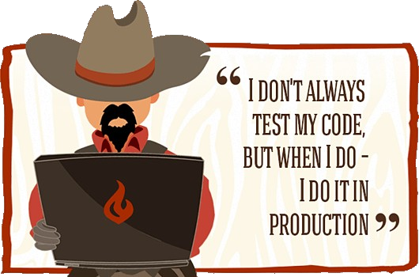

---
layout: quote-image
---

# Inspirational Quote

::author::

::image::

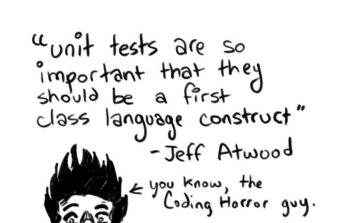

---
layout: section
---

# UnitTesting?

::subtitle::

Job of the Tech Lead / Architect

---
layout: default
---

# UnitTesting?

## Job of the Tech Lead / Architect

<v-clicks>

- Setup Testing
- Configure CI
- Convince Managers, Business, ...
- Teach/Help with implementation

</v-clicks>

---
layout: section
---

# Why

---
layout: default
---

# Why

<v-clicks>

- Small continuous steps forward
- Avoiding Regressions
- Living Documentation
- Quick Feedback Loop (Avoid I/O)
- Fixing Bugs
- Thinking about Design
- Pay Now vs Pay More Later

</v-clicks>

---
layout: default
---

# What? "FIRST"

<v-clicks>

- **Fast** -- Feedback loop
- **Independent** -- Tests should not interact with one another
- **Repeatable** -- Without code change test results do not change
- **Self-Validating** -- No manual steps allowed!
- **Thorough** -- Don't just test the happy path
  - Or: **Timely** -- write them at the same time

</v-clicks>

---
layout: default
---

# What

<v-clicks>

- Business Logic / Weird Rules
- Legacy Code
- Regression Galore
- Technical Frameworks / Design
- "select isn't broken"

</v-clicks>

---
layout: section
---

# 100% Coverage?

---
layout: content-image
---

# 100% Coverage?

<v-clicks>

- Startup Code?
- Trivial Code?
- Branchless Code?
- Technical Code?
- One-time migrations?
- Configuration as Code?

</v-clicks>

::image::

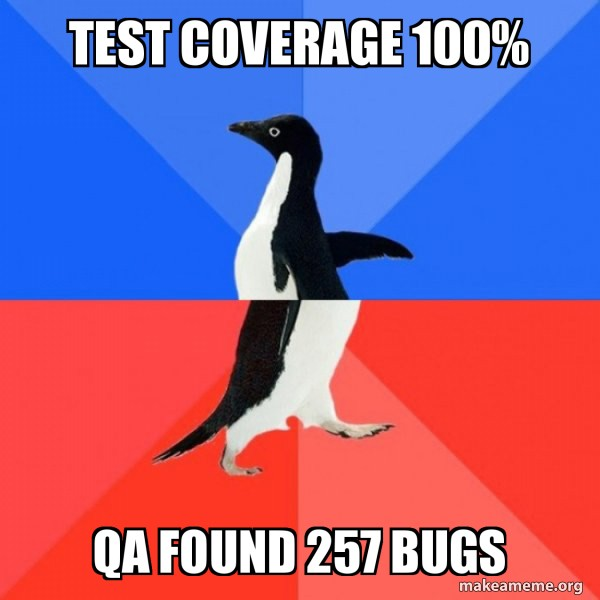

---
layout: default
---

# 100% Coverage?

## It does not cover all bases

<div class="flex justify-center mt-8">
  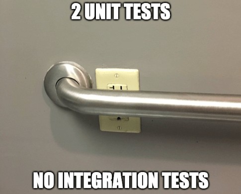
</div>

---
layout: default
---

# 100% Coverage?

<div class="flex justify-center">
  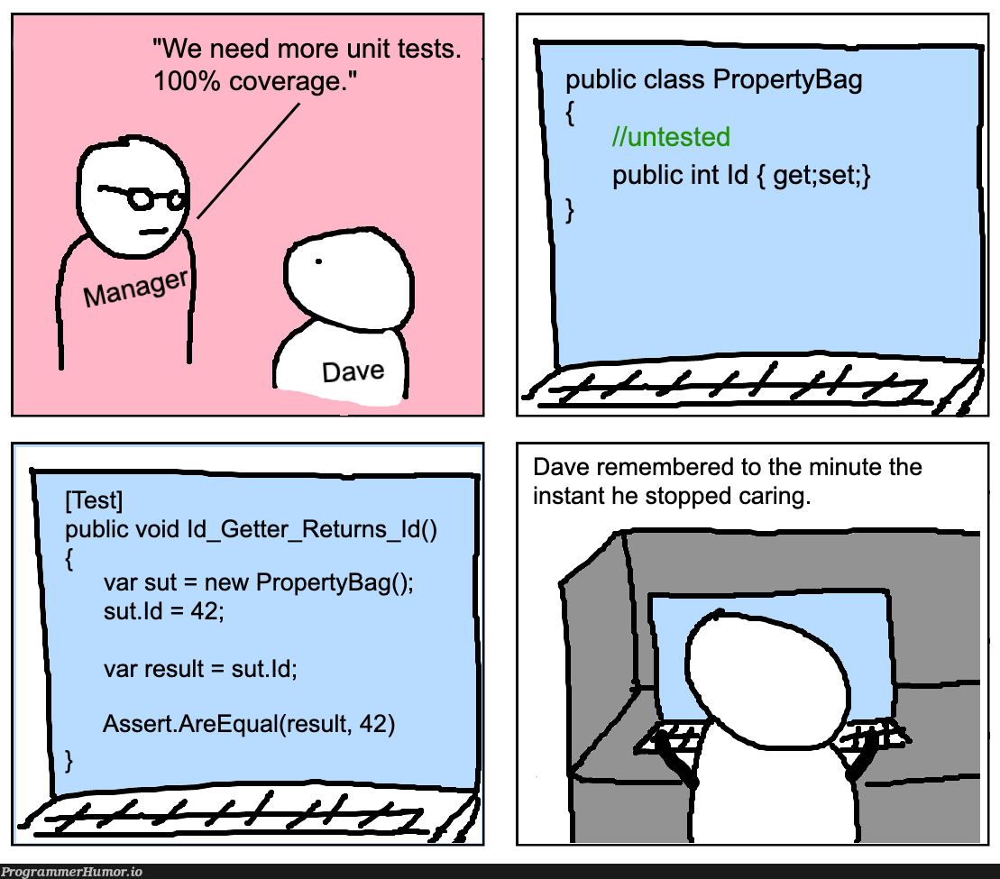
</div>

---
layout: default
---

# But What?

<v-clicks>

- A Happy Path / Sunny Day Test
- Test Branches (if/switch)
- Unhappy paths (GuardClauses, Exceptions, ...)
- Common / Real World Scenarios
- Boundaries

</v-clicks>

---
layout: default
---

# But What?

## Code Coverage vs Branch Coverage

```cs
// Example 1
if (condition1) {} else {}
if (condition2) {} else {}
```

```cs
// Example 2
if (cond1 && (cond2 || cond3)) {}
```

---
layout: default
---

# But What?

## Boundaries

<v-clicks>

- Equivalence Partitioning
- Boundary Value Analysis
- Edge Case Testing

</v-clicks>

---
layout: section
---

# Quick Feedback Loop

::subtitle::

Achievable Only By Avoiding I/O

---
layout: default
---

# Quick Feedback Loop

## Achievable Only By Avoiding I/O

<v-clicks>

- Database
- FileSystem
- Network Access
- Rest Calls

</v-clicks>

---
layout: default
---

# Quick Feedback Loop

## Achievable Only By Avoiding I/O

| Operation | Typical Latency | Overhead Compared to RAM |
|---|---|---|
| In-Memory Access | 10-100 ns | Baseline |
| SSD Read | 50-100 us | ~500x to 1,000x |
| HDD Read | 5-10 ms | ~10,000x to 100,000x |
| Network File Access | 1-10 ms | ~10,000x or more |

---
layout: section
---

# Test Doubles

::subtitle::


---
layout: default
---

# State vs Behavior

<v-clicks>

- **State Testing**
  - Validate that a property has a certain value
- **Behavior Testing**
  - Validate that a method was (not) called

</v-clicks>

---
layout: default
size: size-sm
---

# Mocking

<v-clicks>

- **Dummy**: Passed around but not relevant for the test itself
- **Fake**: Has actual implementation but takes shortcuts
- **Stub**: Provide canned values
- **Spy**: Record what happened, what methods were (not) called
- **Mock**: Stub + Spy

</v-clicks>

---
layout: default
---

# Mocking

## Abstract the I/O dependencies away

## Program against an interface, not an implementation

---
layout: default
size: size-xs
---

# Mocking

## Mockist vs Classicist

<div class="cols">
<div class="col">

### Mockist / Solitary

- Mock everything
- Test complicated BL in isolation
- May be testing implementation instead of behavior

</div>
<div class="col">

### Classicist / Sociable

- Mock I/O and/or "awkward" things
- Tests survive refactorings more easily
- Danger of testing the same thing multiple times

</div>
</div>

---
layout: section
---

# Tautological Tests

::subtitle::

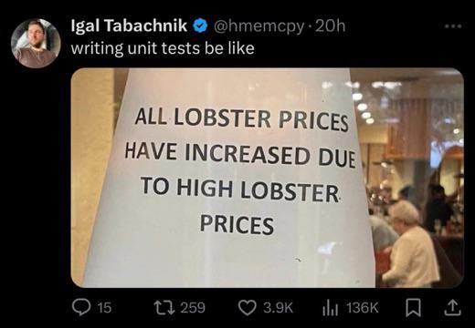

---
layout: default
---

# Tautological Test

## It just repeats the code

```cs
var repo = Substitute.For<IRepository>();
repo.Get().Returns(["obj1", "obj2"]);
var ctl = new Controller(repo);

var result = ctl.Get();

Assert.That(result, Is.Not.Null);
Assert.That(result.Length, Is.EqualTo(2));
```

---
layout: section
---

# Implementation

---
layout: default
---

# Implementation

<v-clicks>

- Testing & Mocking Framework
  - Typically has SetUp/TearDown hooks
  - Usually works with Attributes/Decorators
- Test method naming convention
- Put the tests close to the code

</v-clicks>

---
layout: comparison
---

# Implementation

<div class="cols">
<div class="col">

### AAA

- **A** -- Arrange
- **A** -- Act
- **A** -- Assert

</div>
<div class="col">

### GWT

- **G** -- Given
- **W** -- When
- **T** -- Then

</div>
</div>

<div class="full-width text-center mt-8 italic text-orange-400">
Please don't add these three as a comment in each test
</div>

---
layout: section
---

# Common Pitfalls

::subtitle::

Only test production code

---
layout: default
---

# Common Pitfalls

## Only test production code

<div class="flex justify-center mt-4">
  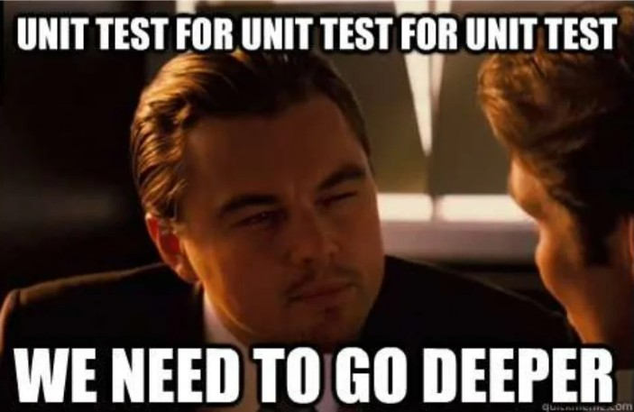
</div>

---
layout: default
---

# Common Pitfalls

## Make sure your test fails at least once

<div class="full-width text-xxl text-center mt-16">

Are you testing what you think you are testing?

</div>

---
layout: default
---

# What are you testing?

<div class="flex justify-center">
  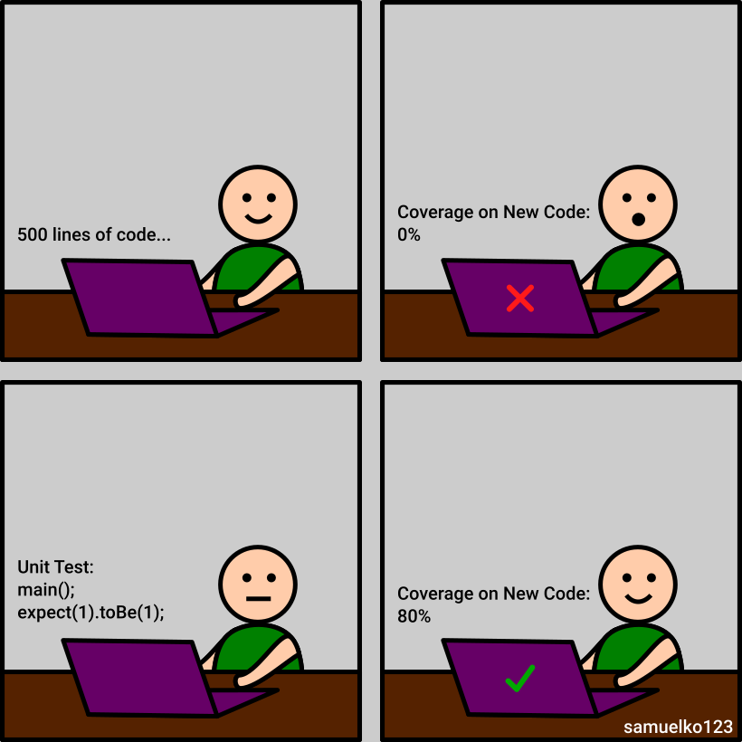
</div>

---
layout: default
---

# Common Pitfalls

<div class="full-width text-xxl text-center mt-24">

Avoid brittle tests

</div>

---
layout: default
---

# Common Pitfalls

<div class="full-width text-xl text-center mt-16">

Failures should be informative

</div>

<div class="mt-12 text-center">

Avoid: `CollectionAssert(bigCollection, otherCollection)`

</div>

---
layout: section
---

# Legacy Code

::subtitle::

The UnitTesting Dilemma

---
layout: default
---

# Legacy Code

## The UnitTesting Dilemma

<div class="full-width text-xl text-center mt-16">

To change the code, we need tests

To test code, we need to change it

</div>

---
layout: default
---

# Legacy Code

## How to test tricky code

<v-clicks>

- Singleton
  - Create an internal setter
  - Optionally create an interface
- Service Locator
  - Register stubs to the IOC

</v-clicks>

---
layout: default
---

# Legacy Code

## How to test tricky code

<v-clicks>

- Static Methods
  - Switch to ServiceLocator or Singleton
  - Or even better, switch to DI

</v-clicks>

---
layout: section
---

# Test Driven Development

::subtitle::

Red -- Green -- Refactor

---
layout: content-image
---

# Test Driven Development

## Red -- Green -- Refactor

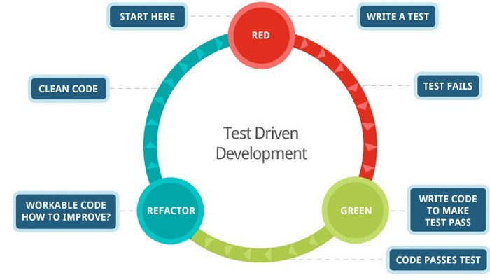

::image::


---
layout: default
---

# Test Driven Development

<v-clicks>

- Tests are actually written
- Thinking about design
- Guaranteed continuous progress
- Breaking the "cycle of fear"
- A whole bunch of useless tests?
- Initial slow down

</v-clicks>

---
layout: content-image
---

# Breaking the Cycle of Fear

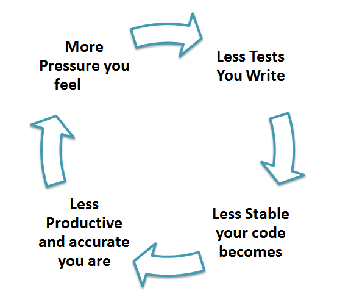

::image::


---
layout: default
---

# Resources

**Books:**

<v-clicks>

- Working Effectively with Legacy Code
- The Art Of UnitTesting
- Test Driven Development
- xUnit Test Patterns: Refactor Test Code

</v-clicks>

<div class="mt-4">

- Fowler: Mocks Aren't Stubs

</div>

---
layout: quote
---

# And Remember...

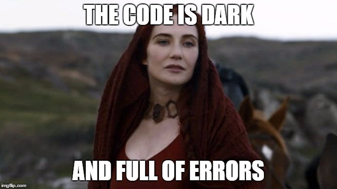

---
layout: socials
---

---
layout: default
---

# Powerpoint Source

<div class="flex flex-col items-center justify-center h-full -mt-16">
  <div class="w-64 h-64">
    <QRCode url="https://github.com/itenium-be/Presentations" color="#343434" />
  </div>
  <a href="https://github.com/itenium-be/Presentations" class="mt-4 text-lg">github.com/itenium-be/Presentations</a>
</div>

---
layout: end
---
